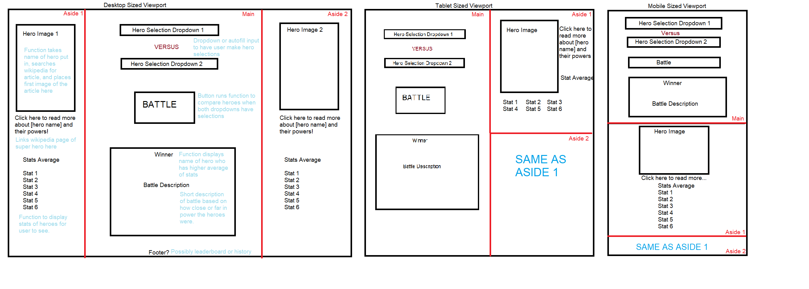

# Superhero Clash!

## Project Description

Our project is a webpage users can use to compare two superheroes to find out which is stronger. We will be using two APIs. The first API is "Superhero API", which will allow us look up heroes and some statistics about how strong they are. The second API is "Wikipedia API", which will allow us to take an image from a superheroes wikipedia entry to display on our webpage, as well as provide a link to their powers and abilities section. 

## User Story

AS A user who is discussing superheroes
I WANT to compare which superhero is stronger
SO THAT I can use real data to back up my claims

## Work Flow

GIVEN When I want to compare to superhero's strengths 
WHEN I click one the dropdown menu
THEN I am presented with a list of superheroes to select from
WHEN I select two heroes, I can then press a button to have them battle
THEN the viewport displays a message saying who is stronger, their stats are displayed, and images of them appear
WHEN I click on one of the images
THEN I am taken to the powers and abilities section of their wikipedia page 

## Active Development Notes

Team needs to decide roles and responsibilities. 

Team needs to discuss if we wish to coordinate times to work together or work mostly separately.

Figure out deadlines for individual pieces so other contributors can utilize it and deadlines for final contributions so the project manager has time to ensure all of the code fits together flawless. 

Discuss if Superhero API is worth using. Data pulled from there is underwhelming and may be difficult to use. Discuss if would we look for a different superhero api, or pivot to another battle system like pokemon. 

## Development beyond MVP

Random Button

Messages detailing more than just "X would Win" or "They would Tie". Random messages, or messages with different text based on the magnitude of difference between power levels. 

## Future Development
Allowing of multiple heroes to be grouped together in teams

## Wireframe 

## Work Division 

Student - Style: This person is responsible for implementing the CSS framework to match our wireframe. They are also in charge of making sure the UI is polished and responsive. 

Student - Superhero API: This person is responsible for Superhero API. They need to make sure the webpage allows for input of a superheroes name for the API to query. The API then needs to return the array of power stats of both user inputs, compare them, and output a descriptive message of who would win. 

STUDENT - Wikipedia API: This person is responsible for the Wikipedia API. They need to make sure they can receive the name of the superhero the user wants. They then need to take that name and query wikipedia for it. They need to display an image of that hero on our webpage. When that image is clicked on, the webpage needs to open a new tab to the powers and abilities section of the wikipedia article about that superhero.

STUDENT - Project Management: Merging and pushing code, refactoring and ensuring everything works together, assisting other students with their code, creating presention, and additional coding tasks as needed. 

Note- Divisions of responsibilities need to be fluid. If a particular tasks is expected to be 25% of the total work and it actually takes 5% of the time, it's in our best interests to figure out how we can more evenly divide work. Even if you're finished with "you

## Project Considerations: 

Work load should be a little fluid. If we think using a particular API is going to be 20% of the total work, and it only takes 5% of the work, while styling the website takes way more work than anticipated, we should adjust. It's in our best interests to help each other out. If you're finished or you're going to finish very early with "your section", see how you can help because it's "our project" being graded. 

Let's try to utilize "let" as often as you can instead of relying on "var". With function and global scoped variables, people may try to manipulate var in different ways that break our code. This can be a massive source of frustration for us, and it's something we really need to learn as we begin program with collaborators. [Youtube Video on Let vs Var.](https://www.youtube.com/watch?v=XgSjoHgy3Rk)

## Git and Github notes 

Github Main: We can no longer push to the main page (aka, the portion of our webpage that displays). We now need to review each others code and at least one of us needs to accept each others changes. Please DO NOT just auto-merge anything to the main branch. Take the time to review the code. Leave comments. Ask questions. Only when you're sure you're comfortable merging this is going to help advance the project, then do so. When in doubt, discuss it with someone else. 

Github branches: Since we are not able to push to main like our work before, we have to work in individual branches. 

Create a new branch on gitbash: "git checkout -b (name-of-your-new-branch"

Push your new branch to github: "git push origin (name-of-your-new-branch)"

Git Stash: I found a command in git called "git stash". This allows you to stash away local changes you've made to code when you need to make a pull from the main branch. In a nutshell, navigate to the repo in git and add your local files. Instead of commiting them, instead enter "git stash". Then you can git pull from the main branch to get the newest code. VSCode will then allow you to compare the new mainbranch code with what's on your local system to see which bits and bobs you wish to keep. For safety, until you've tried it, I'd still keep a backup of your code somewhere else when you first try it. 

## Development Questions

Part of grading is utilizing local storage. Maybe we can store the last 3 or 5 battles in the footer, or keep track of the strongest heroes that have been graded. 

Superhero API calls by an ID number, not a name. With 700+ heroes, what is the best way to implement this? Instead of having an auto-fill input, is it best to have a dropdown menu people can scroll through. Is there an easy way to export all the names into an array for us to use and are we going to have to manually enter in an array with those names to their ID's. 

Wikipedia API needs a name to search for, not an ID number. What's the best way to pull data from superhero api to then send to Wikipedia API? 

If the "powers and abilties" section doesn't exist for the wikipedia entry, what's the best way to check if that link is invalid so we can send users instead to just the top of the article? Should we just only link to the wikipedia itself? 

## Project Requirements 
### Just copying this down so we do not have to look in a different spot for this. 

You and your group will use everything you’ve learned over the past six modules to create a real-world front-end application that you’ll be able to showcase to potential employers. The user story and acceptance criteria will depend on the project that you create, but your project must fulfil the following requirements:

* Use a CSS framework other than Bootstrap.

* Be deployed to GitHub Pages.

* Be interactive (i.e., accept and respond to user input).

* Use at least two [server-side APIs](https://coding-boot-camp.github.io/full-stack/apis/api-resources).

* Does not use alerts, confirms, or prompts (use modals).

* Use client-side storage to store persistent data.

* Be responsive.

* Have a polished UI.

* Have a clean repository that meets quality coding standards (file structure, naming conventions, follows best practices for class/id naming conventions, indentation, quality comments, etc.).

* Have a quality README (with unique name, description, technologies used, screenshot, and link to deployed application).

## Presentation Requirements

Use this [project presentation template](https://docs.google.com/presentation/d/10QaO9KH8HtUXj__81ve0SZcpO5DbMbqqQr4iPpbwKks/edit?usp=sharing) to address the following: 

* Elevator pitch: a one minute description of your application

* Concept: What is your user story? What was your motivation for development?

* Process: What were the technologies used? How were tasks and roles broken down and assigned? What challenges did you encounter? What were your successes?

* Demo: Show your stuff!

* Directions for Future Development

* Links to the deployed application and the GitHub repository

## Grading Requirements

This project is graded based on the following criteria:

### Technical Acceptance Criteria: 25%

* Satisfies the following code requirements:

  * Application uses at least two [server-side APIs](https://coding-boot-camp.github.io/full-stack/apis/api-resources)

  * Application uses client-side storage to store persistent data.

  * Application doesn't use JS alerts, prompts, or confirms (uses modals instead).

  * Application uses a CSS framework other than Bootstrap.

  * Application is interactive (accepts and responds to user input)

### Concept 10%

* Application should be a unique and novel idea.

* Your group should clearly and concisely articulate your project idea.

### Deployment: 20%

* Application deployed at live URL and loads with no errors.

* Application GitHub URL submitted.

### Repository Quality: 10%

* Repository has a unique name.

* Repository follows best practices for file structure and naming conventions.

* Repository follows best practices for class/id naming conventions, indentation, quality comments, etc.

* Repository contains multiple descriptive commit messages.

* Repository contains a quality README file with description, screenshot, and link to deployed application.

### Application Quality: 15%

* Application user experience is intuitive and easy to navigate.

* Application user interface style is clean and polished.

* Application is responsive.

### Presentation 10%

* Your group should present using a slide deck.

* Every group member should speak during the presentation.

* Your presentation should follow the [Project Presentation Template](https://docs.google.com/presentation/d/10QaO9KH8HtUXj__81ve0SZcpO5DbMbqqQr4iPpbwKks/edit?usp=sharing).

### Collaboration 10%

* There are no major disparities in the number of GitHub contributions between group members.

## How to Submit Your Interactive Front-End Project

**Each member of your group** is required to submit the following for review:

* The URL of the deployed application.

* The URL of the GitHub repository, with a unique name and a README describing the project.