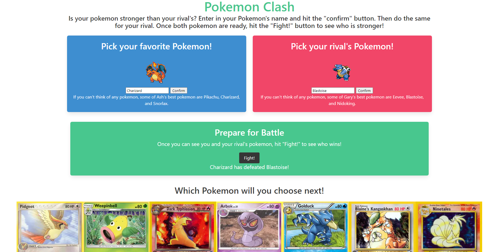

# Pokemon Clash!

## Link to Deployed Project

TBA Once the repo name is changed. 

## Screenshot 

## Project Description

Our project is a webpage users can use to compare two pokemon to find out which is stronger. We will be using two APIs. The first API is PokeAPI, which will allow us look up pokemon and some statistics about how strong they are. The second API is "Wikipedia API", which will allow us to take an image from a pokemon's wikipedia entry to display on our webpage, as well as provide a link to their page.

## User Story

AS A user who wants to beat my rival PokeTrainer

I WANT to compare two Pokemon to see which is stronger

SO THAT I can use data and statistics to quickly see if my Pokemon is stronger

## Work Flow

GIVEN When I want to compare two pokemon's strengths 

WHEN I type into one of the two text input areas

THEN I will be able to start typing a pokemon's name

WHEN I type a pokemon's name

THEN I will be assisted by autocomplete to ensure I get the correct data

WHEN I confirm a pokemon choice

THEN I will see an image of the pokemon appear

WHEN I have hit the two confirm buttons sucessfully

Then I will be able to click the fight button. 

WHEN I press the fight button

THEN I will be able to read a message telling me which pokemon is stronger

WHEN I am told which Pokemon is stronger

THEN I will be given images of trading cards to help me choose different Pokemon to test

## Future Development Ideas

Displaying both pokeon's stats for the user to see

Allowing of multiple pokemon to be grouped together in teams to compare all 6 possible pokemon a trainer can have

Add in pokemon types to adjust stat values to account for weaknesses and resistences 

Adding in pokemon move lists and accounting for turn order to increase accuracy of results

Adding in customizable levels, moves, and other attributes that would affects relative strength

More detailed results messages, such as including what move a pokemon used to "Win" the fight.

Dark Mode

## Work Division 

Jeff - Utilizing Pokemon API to create fight results and TCGDex to add cards to footers

John - Bulma framework design, pair programming, bug fixes on API functions

Faiyaz - TBA

Tanner - TBA

## How to Submit Your Interactive Front-End Project

**Each member of your group** is required to submit the following for review:

* The URL of the deployed application.

* The URL of the GitHub repository, with a unique name and a README describing the project.